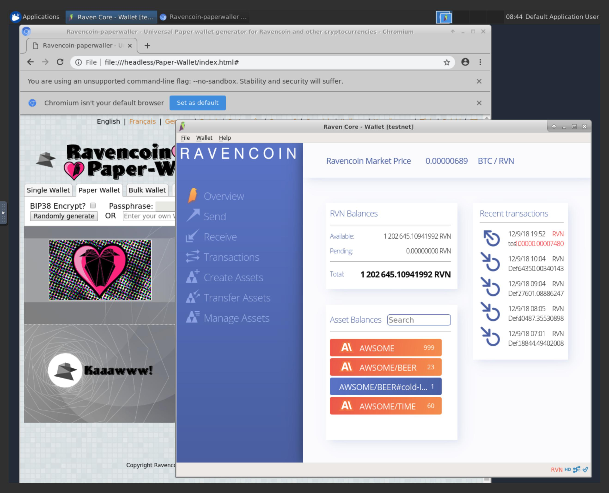

# "headless" Ravencoin Wallet using NOVNC

This repository contains a basic Docker image that will allow to run your Ravencoin wallet in a Docker and view it in browser. You can easily run MainNet and TestNet side by side, and on top of that we've added the Raven Paper Wallet generator.

* Desktop environment [**Xfce4**](http://www.xfce.org)
* VNC-Server (default VNC port `5901`)
* [**noVNC**](https://github.com/novnc/noVNC) - HTML5 VNC client (default http port `6901`)
* Browsers:
  * Chromium
  Wallets:
  * Raven Paper Walet
  * 
  

## Current provided OS & UI sessions:
* `valentinvieriu/raven-wallet-novnc:1.0.0`: __Ubuntu 18.04 with `Xfce4` UI session__

   

## Usage

We recommend using `docker-compose` to build, and run the docker image. Create your own `.env` file in the root. You can get inspiration from the sample file. This file is private and ignored by git and Docker. 

- you can run the docker from the Dockerhub:

      `docker-compose up` or `docker-compose up -d` to run in the background

- By default only one port is exposed ( 6901 ). The rest are comented out
- For the best security, we recommend building the docker localy, and not using the one on Docker Hub
      `docker-compose build`
- Make sure that you have the `data` folder created. This will be shared with the container, and your wallet will be saved in the `data` folder.

# Connect & Control
If the container is started like mentioned above, connect via one of these options:

* connect via __VNC viewer `localhost:5901`__, default password: `password`. Please make sure that the port is exposed in `docker-compose`
* connect via __noVNC HTML5 full client__: [`http://localhost:6901/`](http://localhost:6901), default password: `password` 
* connect via __noVNC HTML5 lite client__: [`http://localhost:6901/vnc_lite.html?password=password`](http://localhost:6901/vnc_lite.html?password=password) 

### 2) Change User of running Sakuli Container

If yuo have issues with the permission, please make sure that you use the env variables provided in `.env` to match your own user `uid` and `gid`

## Donations

Donations are welcomed: 

[RXYFRSyQY5xF8a2dooYwT43zxYwmj5ChYD](https://ravencoin.network/address/RXYFRSyQY5xF8a2dooYwT43zxYwmj5ChYD)

## Contributors

Special thanks to.

* [ConSol](https://github.com/ConSol/docker-headless-vnc-container) - for the initial inspiration
